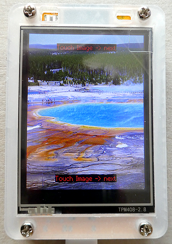
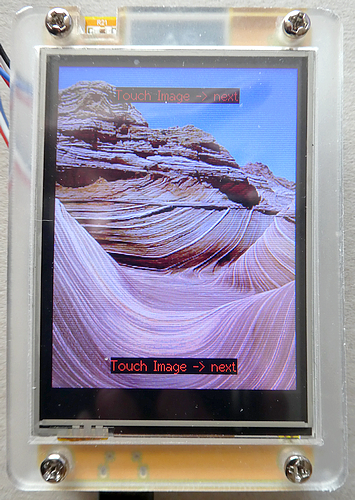

# ESP32 CYD_Display together with Touch Control and SD Card Reader
The ESP32 Cheap Yellow Device is a fantastic device as it comes with a 2.8-inches TFT display with Touch Controller and SD Card Reader mounted on the PCB. But it seemed to be very difficult to use the Touch Controller together with the SD Card Reader. I'm providing two examples how to solve the problem.

This is the accompanying repository for my article "**How to use Touch and SD Card at the same time on an ESP32 Cheap Yellow Display ("CYD")**" available here:

## Runtime Environment
````plaintext
Arduino 2.3.6 (Windows)
esp32 boards version 3.2.0
For compiling and uploading, I'm using the "ESP32-2432S028R CYD" board
````

### Esp32_CYD_TFT_eSPI_SD_with_Touch
This sketch is using the TFT_eSPI library for display together with the XPT2046_Touchscreen library for touch control.

### Esp32_CYD_LovyanGFX_SD_with_Touch
This sketch is using the LovyanGFX library for display and touch control.

## Images used in data folder

I took the two images personally: one is the **Grand Prismatic Spring** in Yellowstone NP, USA. 



The second image is **The Wave**, located in South Coyote Buttes, Utah/Arizona border, USA.


